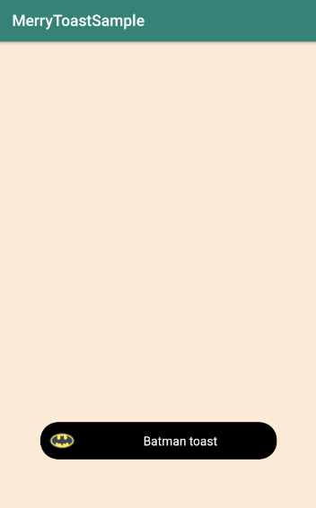

# MerryToast
[](https://jitpack.io/#MaryAgeeva/MerryToast)

Small library for making customized toasts messages (Android)

How to install:
-------
  Library requires SDK ver. 19 and higher
  
  * Gradle:
  -------
  
  Add it in your root build.gradle at the end of repositories:
    
```
allprojects {
  repositories {
    ...
    maven { url 'https://jitpack.io' }
  }
}
```

Step 2. Add the dependency

```
dependencies {
	    implementation 'com.github.MaryAgeeva:MerryToast:0.1-alpha'
}
```

  * Maven:
  -------
  
  Step 1. Add the JitPack repository to your build file
  
```
<repositories>
	<repository>
	    <id>jitpack.io</id>
	    <url>https://jitpack.io</url>
	</repository>
</repositories>
```
  
  Step 2. Add the dependency
  
```
<dependency>
    <groupId>com.github.MaryAgeeva</groupId>
    <artifactId>MerryToast</artifactId>
    <version>0.1-alpha</version>
</dependency>
```
Usage:
-------

With MerryToast you can create predefined type of Toasts, such as:
  * information:
 
```kt
  MerryToast.info(this, "Info toast")
```
  * warning:
 
```kt
  MerryToast.warn(this, "Warning toast")
```
  * success:
 
```kt
  MerryToast.success(this, "Success toast")
```

Also, you can create custom versions of Toasts using Builder:

```kt
  MerryToast.Builder(this)
        .image(R.drawable.icon_batman)
        .color(Colors.BLACK)
        .text("Batman toast")
        .shape(Shapes.OVAL)
        .fixedSize()
        .build()
```

Examples:
-------
  * Custom
  


  * Warning toast
  


  * Info toast
  


  * Success toast
  


